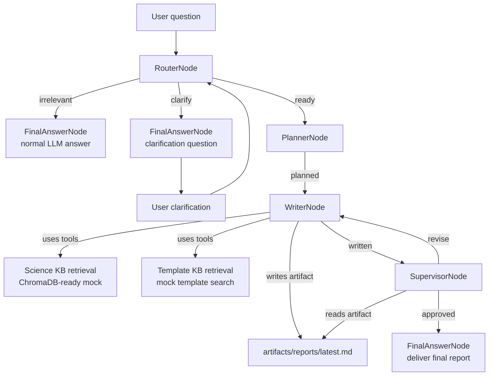

# FT-Agent

FT-Agent is an agent project with two main contributions:

1. A lightweight agent architecture for building custom agents from small primitives.
2. A Fischer-Tropsch catalyst research pipeline built on top of that architecture.

[中文 README](README.zh-CN.md) | [Back to index](README.md)

## Core Idea

FT-Agent treats an agent as a state flow:

- `Node` receives a payload and returns `(action, payload)`.
- `Flow` follows the successor registered for that action. Each action maps to at most one next node.
- `Tool` wraps ordinary Python functions as LLM-callable tools, including OpenAI-compatible schemas.
- `Agent` is a thin runner around a `Flow`.

The result is small enough to understand and modify, but complete enough for tool calls, streaming, trace events, file artifacts, and frontend visualization.

```python
classify_node - "question" >> answer_question_node
classify_node - "statement" >> answer_statement_node
```

## Project Layout

```text
src/ft_agent/
  agent.py              # Agent runner over a Flow
  core/                 # Node, Flow, trace primitives
  llm/                  # DeepSeek/OpenAI-compatible model calls
  tools/                # Tool decorator, schema conversion, executor, file tools
  pipeline/             # Fischer-Tropsch catalyst research pipeline
  web/                  # FastAPI web UI and static frontend
examples/               # Runnable examples
tests/                  # Unit tests
```

## Setup

This project uses `uv` for Python environment and package management.

```powershell
uv sync
Copy-Item .env.example .env
```

Set the local API key in `.env`:

```text
DEEPSEEK_API_KEY=your_key_here
```

The `.env` file is ignored by Git.

Default model settings:

```text
DEEPSEEK_BASE_URL=https://api.deepseek.com
DEEPSEEK_MODEL=deepseek-v4-flash
```

Check the API:

```powershell
uv run ft-agent-check
```

## Lightweight Agent Architecture

### Node

A node implements `exec(payload)` and returns:

```python
return action, payload
```

The action selects the next node, and the payload carries the state the current node wants to pass forward.

### Flow

`Flow` starts from a root node and follows action-specific successors:

```python
router - "ready" >> planner
router - "clarify" >> final_answer
planner - "planned" >> writer
```

### Tool

Use `@tool` to turn a normal Python function into an LLM-callable tool:

```python
from typing import Annotated, Literal

from ft_agent.tools import tool

@tool(description="Look up demo weather for a supported city.")
def get_weather(
    city: Annotated[Literal["Shanghai", "Tokyo"], "English city name."],
) -> dict[str, str]:
    return {"city": city, "condition": "sunny"}
```

The tool schema is derived from the function signature, type annotations, and `Annotated` descriptions.

## Fischer-Tropsch Catalyst Pipeline

The domain pipeline currently includes:

- `RouterNode`: checks whether the question belongs to the Fischer-Tropsch catalyst domain and asks up to three clarification rounds when needed.
- `PlannerNode`: creates a traceable plan based on writer capabilities.
- `WriterNode`: decides whether to retrieve scientific context or templates, then writes the experiment report.
- `SupervisorNode`: reads the report artifact, reviews it against criteria, and asks the writer to revise if needed.
- `FinalAnswerNode`: returns the final report or answers irrelevant questions directly.



The knowledge retrieval tools currently return mock results. ChromaDB is already included so real scientific and template collections can be plugged in later.

## Web UI

Start the local web UI:

```powershell
uv run ft-agent-web
```

Open:

```text
http://127.0.0.1:8765
```

The UI shows a conversation pane and a live pipeline map. It can display:

- Current top-level node
- Tool activity
- Planner progress card
- Token and latency metadata for agent replies
- Markdown report preview

## Examples

Basic flow:

```powershell
uv run python examples/basic_flow.py
```

Plain chatbot:

```powershell
uv run python examples/chatbot.py
uv run python examples/chatbot.py "hello"
```

Tool chatbot:

```powershell
uv run python examples/tool_chatbot.py
```

Fischer-Tropsch router:

```powershell
uv run python examples/ft_router.py "How does cobalt particle size affect methane selectivity?"
```

Router -> planner:

```powershell
uv run python examples/ft_planner.py "How should I design a report about cobalt FT catalyst deactivation?"
```

Router -> planner -> writer:

```powershell
uv run python examples/ft_writer.py --stream "Write an experiment report for improving cobalt FT catalyst stability."
```

Full supervisor review loop:

```powershell
uv run python examples/ft_supervisor.py --trace "Write an experiment report for improving cobalt FT catalyst stability."
```

## Trace

Structured trace events can be collected for terminal debugging or frontend display:

```python
from ft_agent.core import make_trace_options

result = agent.run(payload, trace=make_trace_options(include=["node", "tool", "llm", "plan"]))
events = [event.to_dict() for event in result.trace]
```

## Status

The project now has a usable skeleton:

- Agent runtime
- DeepSeek LLM calls
- Tool schema and executor
- Router/planner/writer/supervisor/final pipeline
- File artifact read/write support
- Web UI
- Basic tests

The next major step is replacing mock scientific and template retrieval with real knowledge bases.

