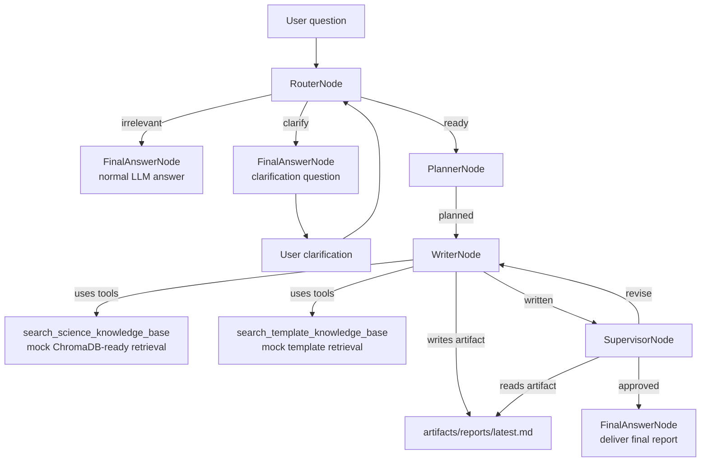

# ft-agent

An agent project under active development.

## Setup

This project uses `uv` for Python environment and package management.

```powershell
uv sync
Copy-Item .env.example .env
```

Set `DEEPSEEK_API_KEY` in the local `.env` file. The `.env` file is ignored by Git.

## DeepSeek

The default DeepSeek settings are:

- `DEEPSEEK_BASE_URL=https://api.deepseek.com`
- `DEEPSEEK_MODEL=deepseek-v4-flash`

Run the API check:

```powershell
uv run ft-agent-check
```

## Project Shape

The project is organized around a small node-flow agent runtime:

- `src/ft_agent/core/node.py`: node and flow abstractions
- `src/ft_agent/llm/`: model calls and LLM-backed nodes
- `src/ft_agent/tools/`: tool definitions, tool execution, and tool-call nodes
- `src/ft_agent/pipeline/`: ft-agent domain pipeline nodes
- `src/ft_agent/agent.py`: thin agent runner over a flow
- `src/ft_agent/util/`: project utilities and checks
- `examples/`: runnable sketches for flow composition

Each node returns `(action, payload)`. The `Flow` follows `node.successors[action]`, so each action maps to at most one next node.

```python
classify_node - "question" >> answer_question_node
classify_node - "statement" >> answer_statement_node
```

## FT Pipeline



The current full path is `router -> planner -> writer -> supervisor -> final`.
The writer and supervisor loop until the supervisor approves the report or the revision limit is reached.

## Web UI

Run the local web UI:

```powershell
uv run ft-agent-web
```

Then open http://127.0.0.1:8765. The UI has a conversation pane on the left and a live top-level node trace on the right.

Run the local flow example:

```powershell
uv run python examples/basic_flow.py
```

Run the chatbot example:

```powershell
uv run python examples/chatbot.py
uv run python examples/chatbot.py "hello"
```

Run the mocked weather tool flow:

```powershell
uv run python examples/weather_tool_flow.py
```

Define tools with the `@tool` decorator:

```python
from typing import Annotated, Literal

from ft_agent.tools import tool

@tool(description="Look up demo weather for a supported city.")
def get_weather(
    city: Annotated[Literal["Shanghai", "Tokyo"], "English city name."],
) -> dict[str, str]:
    return {"city": city, "condition": "sunny"}
```

Run the multi-turn tool chatbot:

```powershell
uv run python examples/tool_chatbot.py
```

Run the Fischer-Tropsch catalyst router:

```powershell
uv run python examples/ft_router.py "How does cobalt particle size affect methane selectivity?"
```

The router owns clarification and will ask up to three follow-up questions before handing off a best-effort deliverable question.
Questions outside the Fischer-Tropsch catalyst scope are routed to `FinalAnswerNode`, which answers them with a normal LLM call instead of entering the specialist pipeline.

Run the router-to-planner pipeline:

```powershell
uv run python examples/ft_planner.py "How should I design a report about cobalt FT catalyst deactivation?"
```

Stream raw LLM deltas for long-running router/planner stages:

```powershell
uv run python examples/ft_planner.py --stream "How should I design a report about cobalt FT catalyst deactivation?"
```

Run the router-planner-writer pipeline with mock knowledge retrieval:

```powershell
uv run python examples/ft_writer.py --stream "Write an experiment report for improving cobalt FT catalyst stability."
```

ChromaDB is included as the vector-store dependency; the current writer retrieval tools return mock scientific and template results until real collections are populated.

Run the supervisor review loop:

```powershell
uv run python examples/ft_supervisor.py --trace "Write an experiment report for improving cobalt FT catalyst stability."
```

Enable runtime trace output:

```powershell
uv run python examples/tool_chatbot.py --trace --trace-events node,tool
```

Programmatic runs can collect structured trace events for UI display:

```python
from ft_agent.core import make_trace_options

result = agent.run(payload, trace=make_trace_options(include=["node", "tool"]))
events = [event.to_dict() for event in result.trace]
```
