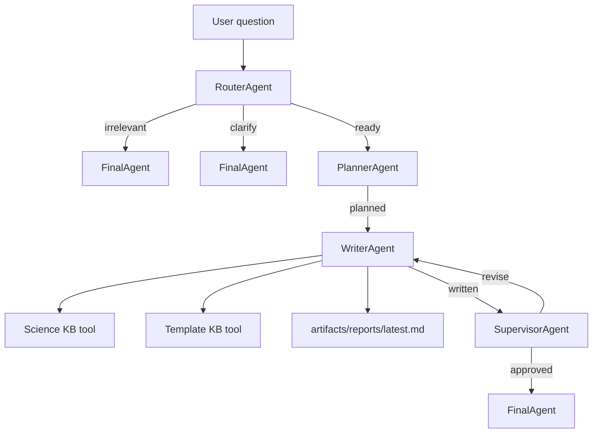

# FT-Agent

FT-Agent is a Fischer-Tropsch catalyst research application built on top of
[agent-core-runtime](https://github.com/Lancetwang/agent-core-runtime).

[Chinese README](README.zh-CN.md)

## What This Version Is

This repository is intentionally application-only:

- Runtime primitives come from `agent-core-runtime`.
- FT-Agent defines Fischer-Tropsch prompts, role agents, mock retrieval tools, and a small web UI.
- The top-level pipeline is composed from role agents, and each role agent owns its inner node flow.

## Architecture



## Layout

```text
src/ft_agent/
  pipeline.py           # FT role nodes, role agents, tools, and builders
  web/                  # FastAPI app and static frontend
examples/
tests/
```

## Setup

```powershell
uv sync
Copy-Item .env.example .env
```

Fill `.env`:

```text
LLM_API_KEY=your_key_here
LLM_BASE_URL=https://api.deepseek.com
LLM_MODEL=deepseek-v4-flash
```

## Run

```powershell
uv run ft-agent-web
```

Open:

```text
http://127.0.0.1:8765
```

## Example

```powershell
uv run python examples/run_pipeline.py "Write an experiment report for cobalt FT catalyst stability."
```

## Test

```powershell
uv run python -m unittest discover -s tests
uv run python -m compileall src tests examples
```

## Notes

The scientific and template retrieval tools currently return mock content. ChromaDB
is included so real collections can be plugged in later.
