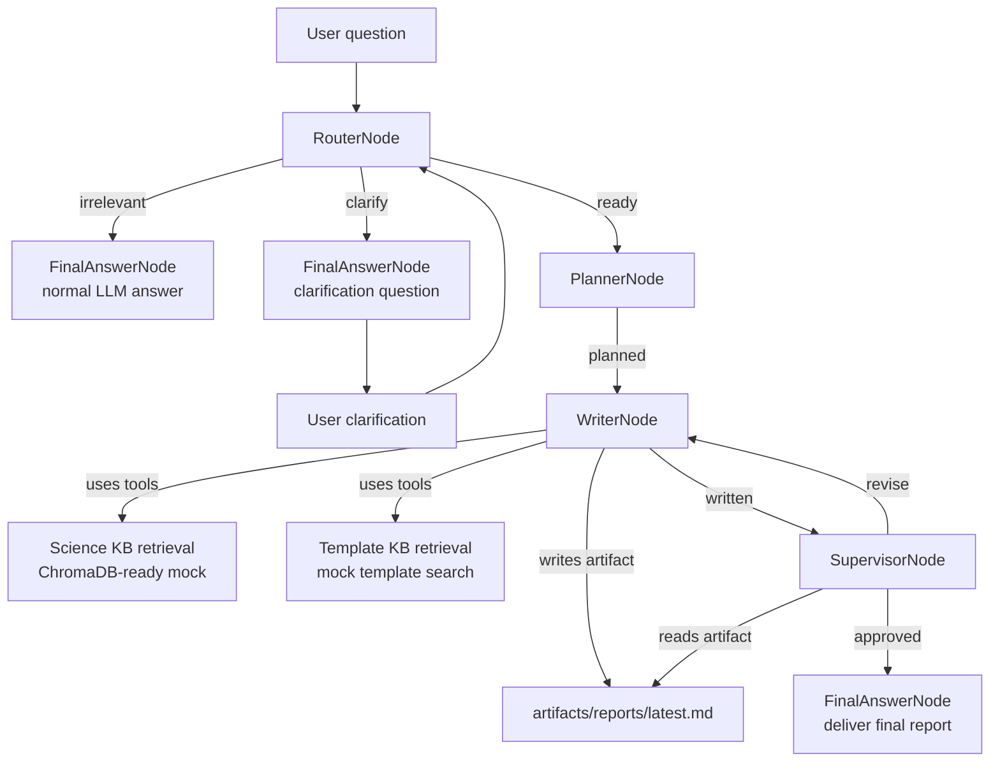

# FT-Agent

FT-Agent 是一个正在演进中的 agent 项目。它有两块主要贡献：

1. 一个轻量级 agent 架构：用 `Node`、`Flow`、`Tool`、`LLM` 这些小元件搭建自己的 agent，不依赖现成 agent 框架。
2. 一个费托催化剂研究体系：围绕 Fischer-Tropsch 催化剂问题，串起路由、澄清、规划、写作、审查和最终交付。

[English README](README.en.md) | [返回入口](README.md)

## 核心思路

FT-Agent 把 agent 看成一个状态流：

- `Node` 是一个处理节点，输入 payload，输出 `(action, payload)`。
- `Flow` 根据 action 选择下一个节点，每个 action 只会流向一个 next node。
- `Tool` 是可注册给 LLM 的函数能力，支持 `@tool` 装饰器和 `Annotated` 参数说明。
- `Agent` 是对 `Flow` 的薄封装，负责运行整个流程。

这些 runtime 元件来自独立的 [agent-core-runtime](https://github.com/Lancetwang/agent-core-runtime) 包。FT-Agent 保留 `ft_agent.core`、`ft_agent.tools`、`ft_agent.agent` 作为兼容 wrapper；费托应用自己的逻辑放在 `ft_agent.llm`、`ft_agent.pipeline` 和 `ft_agent.web` 中。

```python
classify_node - "question" >> answer_question_node
classify_node - "statement" >> answer_statement_node
```

## 项目结构

```text
external dependency
  agent-core-runtime    # Node, Flow, RunContext, tools, agent-loop nodes
src/ft_agent/
  agent.py              # agent_core.Agent 的兼容 wrapper
  core/                 # agent_core.core 的兼容 wrapper
  llm/                  # DeepSeek/OpenAI-compatible model calls
  tools/                # agent_core.tools 的兼容 wrapper
  pipeline/             # Fischer-Tropsch catalyst research pipeline
  web/                  # FastAPI web UI and static frontend
examples/               # Runnable examples
tests/                  # Unit tests
```

## 环境与密钥

项目使用 `uv` 管理 Python 环境和依赖。

```powershell
uv sync
Copy-Item .env.example .env
```

在本地 `.env` 中设置：

```text
DEEPSEEK_API_KEY=your_key_here
```

`.env` 已被 Git 忽略，避免密钥泄露。

默认模型配置：

```text
DEEPSEEK_BASE_URL=https://api.deepseek.com
DEEPSEEK_MODEL=deepseek-v4-flash
```

检查 API：

```powershell
uv run ft-agent-check
```

## 轻量级 Agent 架构

### Node

节点只需要实现 `exec(payload)`，并返回：

```python
return action, payload
```

`action` 决定后续流向；`payload` 保存当前节点愿意交给后续节点的状态。

### Flow

`Flow` 从起始节点开始运行，根据节点返回的 action 查找 successor：

```python
router - "ready" >> planner
router - "clarify" >> final_answer
planner - "planned" >> writer
```

### Tool

可以用 `@tool` 把普通 Python 函数转换成 LLM 可用工具：

```python
from typing import Annotated, Literal

from ft_agent.tools import tool

@tool(description="Look up demo weather for a supported city.")
def get_weather(
    city: Annotated[Literal["Shanghai", "Tokyo"], "English city name."],
) -> dict[str, str]:
    return {"city": city, "condition": "sunny"}
```

工具 schema 会从函数签名、类型标注和 `Annotated` 描述中生成。

## 费托催化剂研究 Pipeline

当前专业流程包含：

- `RouterNode`：判断问题是否属于费托催化剂领域；必要时最多澄清 3 轮。
- `PlannerNode`：根据 writer 的能力生成可追踪计划。
- `WriterNode`：自主决定是否检索科学知识库、模板知识库，并写出实验报告。
- `SupervisorNode`：读取报告文件，按准则审查，不通过则要求 writer 修改。
- `FinalAnswerNode`：交付最终报告，或回答非领域问题。



目前知识库检索工具返回 mock 结果；项目已经引入 ChromaDB，后续可以把真实科学文献库和模板库接进去。

## Web UI

启动本地前端：

```powershell
uv run ft-agent-web
```

打开：

```text
http://127.0.0.1:8765
```

UI 左侧是对话，右侧是 pipeline map。运行时会展示：

- 当前顶层节点
- 工具调用活动
- planner 计划卡片
- agent 回复的 token 和耗时
- Markdown 报告预览

## Examples

基础 flow：

```powershell
uv run python examples/basic_flow.py
```

普通 chatbot：

```powershell
uv run python examples/chatbot.py
uv run python examples/chatbot.py "hello"
```

工具调用 chatbot：

```powershell
uv run python examples/tool_chatbot.py
```

费托 router：

```powershell
uv run python examples/ft_router.py "How does cobalt particle size affect methane selectivity?"
```

router -> planner：

```powershell
uv run python examples/ft_planner.py "How should I design a report about cobalt FT catalyst deactivation?"
```

router -> planner -> writer：

```powershell
uv run python examples/ft_writer.py --stream "Write an experiment report for improving cobalt FT catalyst stability."
```

完整 supervisor review loop：

```powershell
uv run python examples/ft_supervisor.py --trace "Write an experiment report for improving cobalt FT catalyst stability."
```

## Trace

可以开启结构化 trace，用于终端调试或前端展示：

```python
from ft_agent.core import make_trace_options

result = agent.run(payload, trace=make_trace_options(include=["node", "tool", "llm", "plan"]))
events = [event.to_dict() for event in result.trace]
```

## Status

当前项目已经具备完整骨架：

- agent runtime
- DeepSeek LLM 调用
- tool schema 和 tool executor
- router/planner/writer/supervisor/final pipeline
- 文件产物写入和读取
- Web UI
- 基础测试

后续重点是把 mock 科学知识库和模板知识库替换为真实数据。

