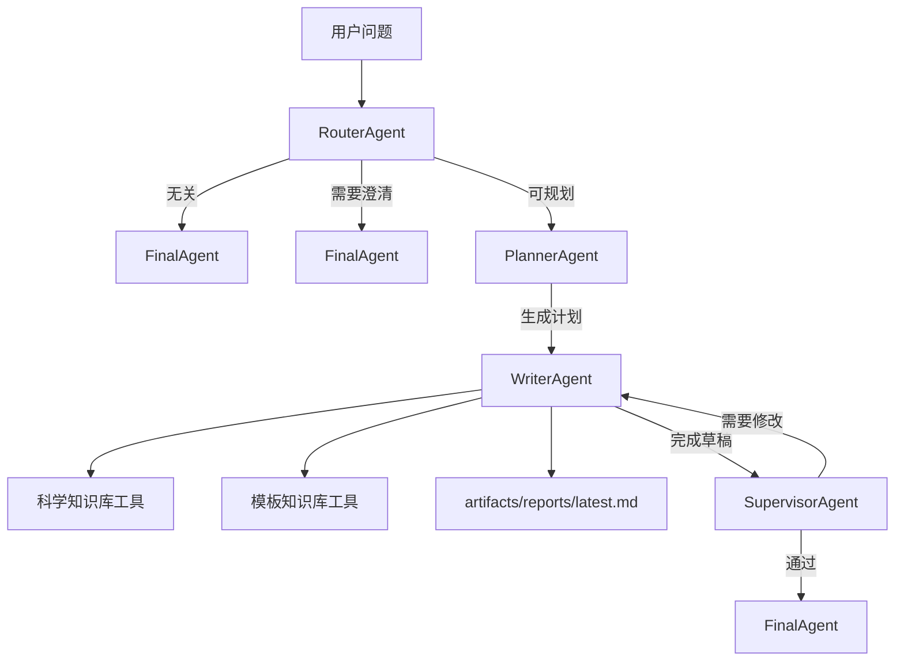

# FT-Agent

[English README](README.md)

FT-Agent 是一个基于 [agent-core-runtime](https://github.com/Lancetwang/agent-core-runtime)
构建的费托催化剂研究 agent。

## 当前版本是什么

这个仓库现在只保留应用层：

- runtime 元件全部来自 `agent-core-runtime`。
- FT-Agent 定义费托催化剂相关 prompt、角色 agent、mock 检索工具和 Web UI。
- 顶层 pipeline 由角色 agent 组成，每个角色 agent 内部持有自己的节点 flow。

## 架构



## 结构

```text
src/ft_agent/
  pipeline.py           # FT 角色节点、角色 agent、工具和 builder
  web/                  # FastAPI app 和静态前端
examples/
tests/
```

## 安装

```powershell
uv sync
Copy-Item .env.example .env
```

填写 `.env`：

```text
LLM_API_KEY=your_key_here
LLM_BASE_URL=https://api.deepseek.com
LLM_MODEL=deepseek-v4-flash
```

## 运行

```powershell
uv run ft-agent-web
```

打开：

```text
http://127.0.0.1:8765
```

## 示例

```powershell
uv run python examples/run_pipeline.py "Write an experiment report for cobalt FT catalyst stability."
```

## 测试

```powershell
uv run python -m unittest discover -s tests
uv run python -m compileall src tests examples
```

## 说明

当前科学知识库和模板知识库工具仍然返回 mock 内容。项目已经包含
ChromaDB 依赖，后续可以接入真实 collection。
